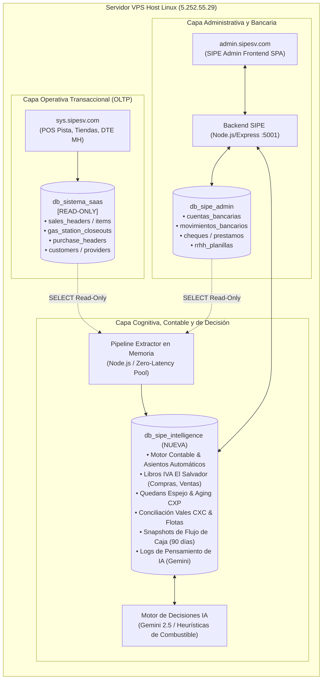

# PLAN ESTRATÉGICO DE INTEGRACIÓN: INTELIGENCIA ARTIFICIAL, CONTABILIDAD AUTOMÁTICA Y CONTROL FINANCIERO

> **Documento Oficial de Arquitectura y Procedimiento Técnico**  
> **Proyecto:** SIPE Admin (`admin.sipesv.com`) & Nova SaaS POS (`sys.sipesv.com`)  
> **Host / Infraestructura:** Servidor VPS Linux (`5.252.55.29`) Detrás de Caddy Reverse Proxy  
> **Fecha de Emisión:** Octubre 2026  
> **Estado:** Aprobado para Planificación e Implementación

---

## 1. Declaración de Principios y Reglas de Oro

1. **Aislamiento Operativo Absoluto de `sys.sipesv.com`:**
   * La base de datos transaccional `db_sistema_saas` **NO se modificará bajo ninguna circunstancia**.
   * Quedan terminantemente prohibidas operaciones `ALTER TABLE`, `INSERT`, `UPDATE` o `DELETE` sobre `db_sistema_saas` durante esta fase.
   * La conexión hacia `db_sistema_saas` se configurará con un usuario MySQL con privilegios estrictos de **Solo Lectura (`SELECT` únicamente)**.
   * La operación en pista (despacho de combustible en bombas, turnos de cajeros, inventario físico y firma electrónica de DTEs ante el Ministerio de Hacienda) permanecerá 100% aislada y protegida contra cualquier falla o prueba.

2. **Aprovechamiento del Entorno Co-Alojado (Zero-Latency Bus):**
   * Dado que tanto `admin.sipesv.com`, `sys.sipesv.com` y MySQL residen físicamente en el mismo servidor VPS (`5.252.55.29`), las lecturas entre bases de datos tienen una latencia interna de **0 milisegundos**.
   * No se consumirán APIs externas lentas ni webhooks propensos a caídas; la extracción se realiza mediante un pipeline en memoria optimizado.

3. **Creación de la Nueva Base de Datos Cognitiva (`db_sipe_intelligence`):**
   * Toda la lógica de contabilidad automática, modelos de predicción de flujo de caja, quedans espejo, analítica de mermas y memoria de agentes de IA se alojará en un nuevo esquema independiente: `db_sipe_intelligence`.

---

## 2. Diagrama de Arquitectura del Ecosistema



---

## 3. Especificación Detallada de los Cuatro Pilares

### Pilar 1: Motor de Contabilidad Automática (Normativa El Salvador)

El objetivo es eliminar la digitación contable manual. Cada evento operativo o bancario generará su respectivo comprobante contable cuadrado de manera automática:

1. **Partida Diaria de Ventas de Estación de Servicio:**
   * **Disparador:** Cierre de turno de pista (`gas_station_closeouts` en estado `cerrado`).
   * **Estructura del Asiento:**
     * **DEBE (Cargos):**
       * `110101` Caja General / Efectivo por remesar.
       * `110201` Cuentas por Cobrar Clientes (Vales de combustible y créditos del turno).
       * `110202` Cuentas por Cobrar Tarjetas de Crédito / POS Pista.
     * **HABER (Abonos):**
       * `410101` Ventas de Combustibles (Súper, Regular, Diésel).
       * `410102` Ventas Tienda de Conveniencia / Lubricantes.
       * `210201` Débito Fiscal IVA (13%).
       * `210202` FOVIAL por Pagar (\$0.20 por galón despachado).
       * `210203` COTRANS por Pagar (\$0.10 por galón despachado).
       * `210204` Retención IVA 1% / Percepción (si aplica).

2. **Partida Automática de Compras e Insumos:**
   * **Disparador:** Registro de CCF o DTE de proveedor en `purchase_headers`.
   * **Estructura del Asiento:**
     * **DEBE:** Compras Gravadas / Inventario, Crédito Fiscal IVA (13%), FOVIAL/COTRANS acreditable.
     * **HABER:** Proveedores Cuentas por Pagar (CXP), Retención 1% IVA (aplicada al Quedan).

3. **Partidas de Recaudación (CXC) y Pagos (CXP):**
   * **Abonos de Clientes:** Carga Bancos (`110102`), Abona Clientes CXC (`110201`).
   * **Liquidación de Quedans con Cheque:** Carga Proveedores CXP (`210101`), Abona Bancos (`110102`).

4. **Libros Fiscales e Informes Financieros en Tiempo Real:**
   * **Libro de Compras:** Clasificación legal de compras gravadas, exentas y de sujetos excluidos.
   * **Libro de Ventas a Contribuyentes (CCF):** Con número de DTE, sello de recepción MH y NIT/NRC.
   * **Libro de Ventas a Consumidor Final:** Consolidación diaria de facturas electrónicas.
   * **Borrador de Declaración F-07 (Ministerio de Hacienda):** Cuadre mensual automático de débito vs. crédito fiscal.
   * **Estados Financieros en Línea:** Balance de Comprobación, Balance General y Estado de Resultados (P&L) por estación.

---

### Pilar 2: Circuito de Quedans, Cuentas por Pagar (CXP) y Cobrar (CXC)

1. **Gestión de Quedans Espejo (en `db_sipe_intelligence`):**
   * Agrupación de comprobantes de compras sin modificar la tabla madre.
   * Cálculo automático del 1% de IVA Retenido (para grandes contribuyentes).
   * Programación de fecha de vencimiento y estado del quedan (`PENDIENTE`, `AUTORIZADO`, `PAGADO`, `ANULADO`).
   * Impresión oficial del Quedan institucional en PDF (tamaño Carta estándar) usando `ReportPreviewModal.jsx` con código de barras / QR de seguridad.

2. **Cuentas por Pagar (CXP) & Antigüedad de Saldos:**
   * Reporte analítico de *Aging* por proveedor (Corriente, 1-15 días, 16-30 días, 31-60 días, +60 días).
   * Calendario semanal de propuestas de pago cruzado con saldos de chequeras en `CuentasBancarias.jsx`.
   * Enlace inteligente en `Cheques.jsx`: Seleccionar Quedan $\rightarrow$ autocompleta monto neto, beneficiario y liquida la deuda del proveedor en la base contable.

3. **Cuentas por Cobrar (CXC) & Auditoría de Vales de Pista:**
   * Conciliación de vales despachados (`gas_station_closeout_creditos`) contra DTEs quincenales emitidos: alerta temprana de combustible consumido sin facturar.
   * Generación y envío automatizado de Estados de Cuenta oficiales en PDF a clientes de flotas.

---

### Pilar 3: Finanzas Estratégicas y Flujo de Caja Continuo

1. **Flujo de Caja Predictivo a 30 / 60 / 90 Días:**
   * Algoritmo de proyección continua que integra:
     $$\text{Flujo Proyectado}(t) = \text{Saldo Bancos}(t) + \mathbb{E}[\text{Ventas Pista}] + \mathbb{E}[\text{Cobranza CXC}] - \text{Quedans CXP}(t) - \text{Nómina}(t) - \text{Préstamos}(t)$$
   * Indicador de Capital de Trabajo Neto y Detección Temprana de Iliquidez.
2. **Control Financiero de Préstamos:**
   * Amortización de capital e intereses de `prestamos` reflejados automáticamente en los gastos financieros del P&L contable.
3. **Márgenes de Rentabilidad por Galón y Estación:**
   * Desglose del margen bruto por tipo de combustible (Súper, Regular, Diésel) restando costos de adquisición, fletes, impuestos viales (FOVIAL/COTRANS) y costos operativos de pista.

---

### Pilar 4: Cerebro de Decisiones e Inteligencia Artificial (AI Engine)

1. **Simulador y Optimizador de Compras Pre-DGEHM:**
   * Análisis automático de las variaciones quincenales de precios de combustible de la DGEHM.
   * Recomendación autónoma para directores: comprar el fin de semana previo si el precio sube, o diferir pedidos si el precio baja.
2. **Auditor Autónomo de Mermas y Descalibraciones:**
   * Monitoreo cruzado: Lecturas mecánicas de bombas vs. Galonajes facturados en DTE vs. Lecturas de vara en tanques.
   * Alerta inmediata ante evaporaciones $>0.4\%$, descalibración de pistolas o sospecha de fuga física.
3. **Scoring Predictivo de Cobranza de Flotas:**
   * Clasificación de clientes según días promedio de pago y porcentaje de cupo utilizado.
   * Generación de recomendaciones preventivas para la gerencia.
4. **Flash Ejecutivo Automatizado:**
   * Síntesis matutina enviada diariamente a las 7:00 AM a socios vía correo electrónico o WhatsApp.

---

## 4. Diseño del Esquema de Base de Datos: `db_sipe_intelligence`

```sql
-- =============================================================================
-- ESQUEMA DDL: db_sipe_intelligence
-- =============================================================================
CREATE DATABASE IF NOT EXISTS `db_sipe_intelligence` 
  DEFAULT CHARACTER SET utf8mb4 COLLATE utf8mb4_unicode_ci;

USE `db_sipe_intelligence`;

-- 1. Catálogo de Cuentas Contables Unificado
CREATE TABLE IF NOT EXISTS intel_chart_of_accounts (
    id INT AUTO_INCREMENT PRIMARY KEY,
    company_id INT NOT NULL,
    code VARCHAR(30) NOT NULL,
    name VARCHAR(255) NOT NULL,
    nature ENUM('debit', 'credit') NOT NULL,
    account_type ENUM('ACTIVO', 'PASIVO', 'PATRIMONIO', 'INGRESOS', 'COSTOS', 'GASTOS') NOT NULL,
    parent_code VARCHAR(30) NULL,
    allows_entries BOOLEAN DEFAULT TRUE,
    active BOOLEAN DEFAULT TRUE,
    created_at TIMESTAMP DEFAULT CURRENT_TIMESTAMP,
    UNIQUE KEY uk_comp_code (company_id, code)
);

-- 2. Cabecera de Partidas Contables Automáticas
CREATE TABLE IF NOT EXISTS intel_accounting_entries (
    id BIGINT AUTO_INCREMENT PRIMARY KEY,
    company_id INT NOT NULL,
    branch_id INT NULL,
    entry_number VARCHAR(50) NOT NULL,
    entry_date DATE NOT NULL,
    entry_type ENUM('VENTAS', 'COMPRAS', 'COBROS', 'PAGOS', 'PLANILLA', 'PRESTAMOS', 'AJUSTE', 'CIERRE') NOT NULL,
    concept TEXT NOT NULL,
    total_debit DECIMAL(14,2) NOT NULL DEFAULT 0.00,
    total_credit DECIMAL(14,2) NOT NULL DEFAULT 0.00,
    status ENUM('draft', 'posted', 'voided') DEFAULT 'posted',
    origin_source VARCHAR(50) NOT NULL COMMENT 'gas_station_closeouts, purchase_headers, etc.',
    origin_id VARCHAR(50) NULL,
    created_at TIMESTAMP DEFAULT CURRENT_TIMESTAMP,
    INDEX idx_comp_date (company_id, entry_date),
    INDEX idx_origin (origin_source, origin_id)
);

-- 3. Detalle de Líneas de Partida Contable
CREATE TABLE IF NOT EXISTS intel_accounting_entry_lines (
    id BIGINT AUTO_INCREMENT PRIMARY KEY,
    entry_id BIGINT NOT NULL,
    account_code VARCHAR(30) NOT NULL,
    account_name VARCHAR(255) NOT NULL,
    description TEXT NULL,
    debit DECIMAL(14,2) NOT NULL DEFAULT 0.00,
    credit DECIMAL(14,2) NOT NULL DEFAULT 0.00,
    FOREIGN KEY (entry_id) REFERENCES intel_accounting_entries(id) ON DELETE CASCADE,
    INDEX idx_acc_code (account_code)
);

-- 4. Registro y Control de Quedans Espejo
CREATE TABLE IF NOT EXISTS intel_quedans (
    id INT AUTO_INCREMENT PRIMARY KEY,
    company_id INT NOT NULL,
    num_quedan VARCHAR(50) NOT NULL,
    provider_id INT NOT NULL,
    proveedor_nombre VARCHAR(255) NOT NULL,
    fecha_emision DATE NOT NULL,
    fecha_pago_prometida DATE NOT NULL,
    monto_bruto DECIMAL(14,2) NOT NULL,
    retencion_1_iva DECIMAL(14,2) DEFAULT 0.00,
    monto_neto_pagar DECIMAL(14,2) NOT NULL,
    status ENUM('PENDIENTE', 'AUTORIZADO', 'EN_PROCESO', 'PAGADO', 'ANULADO') DEFAULT 'PENDIENTE',
    cheque_id INT NULL COMMENT 'Lligado a db_sipe_admin.cheques',
    fecha_pago_real DATE NULL,
    notas TEXT NULL,
    created_at TIMESTAMP DEFAULT CURRENT_TIMESTAMP,
    UNIQUE KEY uk_comp_quedan (company_id, num_quedan)
);

-- 5. Detalle de Documentos Amparados en el Quedan
CREATE TABLE IF NOT EXISTS intel_quedan_items (
    id INT AUTO_INCREMENT PRIMARY KEY,
    quedan_id INT NOT NULL,
    purchase_header_id INT NOT NULL COMMENT 'ID en db_sistema_saas.purchase_headers',
    tipo_documento VARCHAR(20) NOT NULL,
    numero_documento VARCHAR(50) NOT NULL,
    sello_recepcion_mh VARCHAR(255) NULL,
    fecha_documento DATE NOT NULL,
    monto_gravado DECIMAL(14,2) DEFAULT 0.00,
    iva DECIMAL(14,2) DEFAULT 0.00,
    total DECIMAL(14,2) NOT NULL,
    FOREIGN KEY (quedan_id) REFERENCES intel_quedans(id) ON DELETE CASCADE
);

-- 6. Snapshots de Contexto Cognitivo para la IA
CREATE TABLE IF NOT EXISTS intel_ai_snapshots (
    id BIGINT AUTO_INCREMENT PRIMARY KEY,
    snapshot_date DATE NOT NULL,
    category ENUM('TESORERIA', 'CXC_FLOTAS', 'CXP_PROVEEDORES', 'MERMAS_PISTA', 'DGEHM') NOT NULL,
    summary_data_json JSON NOT NULL,
    risk_level ENUM('BAJO', 'MEDIO', 'CRITICO') DEFAULT 'BAJO',
    ai_verdict TEXT NULL,
    created_at TIMESTAMP DEFAULT CURRENT_TIMESTAMP,
    INDEX idx_snap_cat_date (category, snapshot_date)
);

-- 7. Bitácora de Pensamiento y Razonamiento de Agentes IA (CoT)
CREATE TABLE IF NOT EXISTS intel_ai_agent_thoughts (
    id BIGINT AUTO_INCREMENT PRIMARY KEY,
    agent_name VARCHAR(100) NOT NULL,
    trigger_context VARCHAR(100) NOT NULL,
    chain_of_thought TEXT NOT NULL,
    action_suggested VARCHAR(255) NOT NULL,
    confidence_score DECIMAL(5,2) DEFAULT 0.00,
    was_applied BOOLEAN DEFAULT FALSE,
    created_at TIMESTAMP DEFAULT CURRENT_TIMESTAMP
);
```

---

## 5. Plan de Trabajo Paso a Paso (Cronograma por Sprints)

| Sprint | Duración | Entregables Clave | Responsabilidad Técnica |
|---|---|---|---|
| **Sprint 1: Infraestructura y Extracción Segura** | 1 Semana | • Creación física del esquema `db_sipe_intelligence`.<br>• Creación de usuario MySQL `sipe_readonly` sobre `db_sistema_saas`.<br>• Pool multi-conexión seguro en `backend/db.js`. | Backend & DevOps |
| **Sprint 2: Motor Contable & Partidas Diarias** | 2 Semanas | • Parametrización del catálogo y cuentas tributarias (FOVIAL, COTRANS, IVA 13%).<br>• Generador automático de asientos de ventas por cierre de turno.<br>• Generador de asientos de compras y gastos.<br>• Consultas de Balance de Comprobación y P&L. | Backend & Contabilidad |
| **Sprint 3: Libros Fiscales de El Salvador** | 1.5 Semanas | • Pantalla e informes de Libro de Compras IVA.<br>• Pantalla de Libro de Ventas a Contribuyentes y Consumidor Final.<br>• Exportación en PDF Carta (`ReportPreviewModal.jsx`) y Excel.<br>• Borrador de Formulario F-07. | Frontend & Backend |
| **Sprint 4: Quedans, CXP y Enlace Bancario** | 2 Semanas | • Módulo de Gestión de Quedans (Emisión, Estados, Impresión con QR).<br>• Reporte de Antigüedad de Saldos a Proveedores (*Aging*).<br>• Enlace en `Cheques.jsx` para liquidar Quedan y saldar CXP automáticamente. | Fullstack |
| **Sprint 5: CXC Flotas, Vales y Flujo de Caja** | 2 Semanas | • Conciliación de Vales de Pista vs. DTEs Quincenales emitidos.<br>• Generador de Estados de Cuenta oficiales en PDF.<br>• Algoritmo de Flujo de Caja Predictivo a 30/60/90 días. | Fullstack |
| **Sprint 6: Motor de Decisiones IA y Flash Ejecutivo** | 1.5 Semanas | • Integración con Gemini API para Asesor DGEHM de Combustible.<br>• Auditor autónomo de mermas y descalibración de pistolas.<br>• Envío matutino automatizado del Flash Ejecutivo a directores. | IA & Fullstack |

---

## 6. Procedimiento Estándar de Ejecución y Despliegue

Siguiendo las directrices del proyecto y el archivo `AGENTS.md`, todo avance técnico deberá regirse por los siguientes pasos estrictos:

1. **Verificación Previa de Pruebas y Linters:**
   ```bash
   cd backend && npm test
   cd backend && npm run lint
   cd frontend && npm run lint
   ```
2. **Incremento de Versión Obligatorio:**
   ```bash
   cd frontend && npm run bump
   ```
3. **Sincronización Git Previa al Push:**
   ```bash
   git fetch origin main
   git pull --rebase origin main
   ```
4. **Commits Semánticos en Español:**
   * `feat: implementar esquema db_sipe_intelligence y conexion read-only`
   * `feat: agregar generador automatico de partidas diarias de ventas`
   * `feat: implementar modulo de quedans y reporte aging cxp`
5. **Despliegue a Producción:**
   ```bash
   npm run deploy
   ```
   *(El webhook en puerto 9000 desplegará automáticamente en el VPS bajo PM2 y Caddy sin tiempo de inactividad).*

---

*Documento formal generado y guardado en la raíz del proyecto para consulta y ejecución del equipo técnico.*
