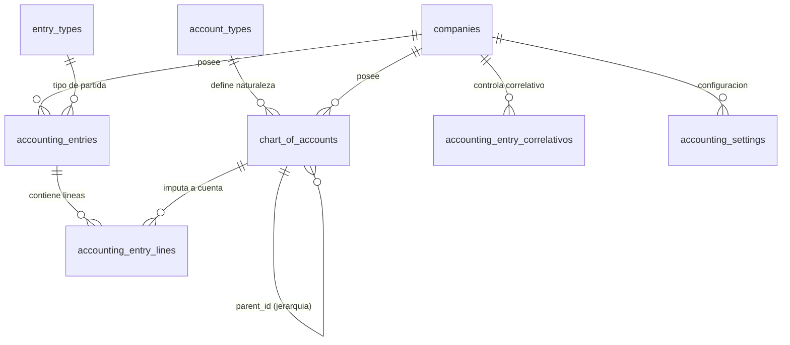

# Estructura y Diccionario de Base de Datos: Nova SaaS (`db_sistema_saas`)

Documento técnico de referencia para la conexión externa y contable desde **SIPE Admin** hacia la base de datos de **Nova SaaS**.

---

## 1. Información General de Conexión

- **Nombre de Base de Datos:** `db_sistema_saas`
- **Gestor:** MySQL 8.x
- **Host / Servidor:** `5.252.55.29`
- **Puerto:** `3306`
- **Usuario:** `sysadmin`
- **Total de Tablas:** 220 tablas
- **Total de Columnas:** 2,264 columnas
- **Total de Llaves Foráneas:** 271 relaciones declaradas
- **Archivo Schema Raw (JSON):** [nova_saas_db_schema.json](file:///c:/Users/Roberto/Desktop/web/sipeadmin/backend/nova_saas_db_schema.json)

---

## 2. Arquitectura Multi-Tenant (Regla Crítica)

El sistema Nova SaaS opera bajo una arquitectura multi-inquilino (*multi-tenant*) compartida en la misma base de datos:

1. **Aislamiento por Empresa (`company_id`):**
   - Casi todas las tablas operativas, contables y transaccionales poseen la columna `company_id INT NOT NULL`.
   - **Toda consulta SQL que involucre datos transaccionales DEBE incluir obligatoriamente el filtro `WHERE company_id = ?`**.
   - Solo existen tablas globales independientes de la empresa: `account_types`, `entry_types` y los catálogos oficiales del Ministerio de Hacienda (`cat_001_*` a `cat_030_*`).

2. **Aislamiento por Sucursal (`branch_id`):**
   - Cuando la entidad pertenezca a un punto físico o sucursal (ej. inventarios, turnos POS, ventas en mostrador, cierres de pista), se debe filtrar también por `branch_id = ?`.

### Empresas Activas Registradas (`companies`)
| ID (`company_id`) | Razón Social | Nombre Comercial | NIT | NRC |
|---|---|---|---|---|
| **1** | Inversiones Lil, S,A, de C,V. | INV LIL | `0614-270114-103-3` | `230360-6` |
| **2** | Raul Rafael Sosa Castellanos | (Persona Natural) | `0614-140268-004-3` | `155323-0` |
| **8** | Corina Margarita Mendez de Sosa | (Persona Natural) | `0614-250667-002-8` | `103276-3` |
| **9** | ANDELSA, S.A. DE C.V. | Andelsa | `0614-070513-102-1` | `224745-0` |

---

## 3. Módulo Contable (Estructura en Profundidad)

Nova SaaS dispone de un subsistema contable completo con catálogo jerárquico, partidas automáticas y manuales, correlativos mensuales y parametrización de cuentas contables.



### 3.1. `account_types` (Tipos de Cuenta - Global)
Catálogo base compartido por todas las empresas. Define si la naturaleza habitual de la cuenta es Deudora o Acreedora.

| Campo | Tipo | Nulo | Descripción |
|---|---|---|---|
| `id` | INT | NO (PK) | Identificador del tipo |
| `code` | VARCHAR(10) | NO | Código corto (`ACT`, `PAS`, `PAT`, `ING`, `COS`, `GAS`) |
| `name` | VARCHAR(100) | NO | Nombre (Activo, Pasivo, Patrimonio, Ingresos, Costos, Gastos) |
| `nature` | ENUM('debit','credit') | NO | Naturaleza contable |
| `created_at` | TIMESTAMP | SI | Fecha de registro |

### 3.2. `entry_types` (Tipos de Partida Contable - Global)
Tipos de comprobantes contables admitidos:

| ID | Código | Nombre |
|---|---|---|
| 1 | `DIARIO` | Partida Diaria |
| 2 | `INGRESO` | Partida de Ingreso |
| 3 | `GASTO` | Partida de Gasto |
| 4 | `APERTURA` | Partida de Apertura |
| 5 | `CIERRE` | Partida de Cierre |
| 6 | `AJUSTE` | Partida de Ajuste |
| 7 | `VENTAS` | Partida de Ventas (Automática) |
| 8 | `COMPRAS` | Partida de Compras (Automática) |
| 9 | `CXC` | Partida de Cobranzas (Automática) |
| 10 | `CXP` | Partida de Pagos (Automática) |

### 3.3. `chart_of_accounts` (Catálogo de Cuentas Contables)
Estructura jerárquica con soporte de cuentas de mayor y cuentas de detalle (*allows_entries = 1*).

| Campo | Tipo | Nulo | Clave | Descripción |
|---|---|---|---|---|
| `id` | INT | NO | PRI | Identificador único de la cuenta |
| `company_id` | INT | NO | MUL (FK) | `companies.id` |
| `account_type_id` | INT | NO | MUL (FK) | `account_types.id` |
| `parent_id` | INT | SI | MUL (FK) | `chart_of_accounts.id` (Cuenta padre para árbol) |
| `code` | VARCHAR(20) | NO | | Código contable (ej. `1101`, `110101`, `2101`) |
| `name` | VARCHAR(200) | NO | | Nombre o descripción de la cuenta |
| `description` | TEXT | SI | | Observaciones adicionales |
| `allows_entries` | TINYINT(1) | SI | | `1` = Cuenta de detalle (imputable), `0` = Cuenta de mayor |
| `active` | TINYINT(1) | SI | | `1` = Activa, `0` = Inactiva |
| `created_at` | TIMESTAMP | SI | | Fecha de creación |
| `updated_at` | TIMESTAMP | SI | | Última modificación |

### 3.4. `accounting_entries` (Cabecera de Partidas Contables)

| Campo | Tipo | Nulo | Clave | Descripción |
|---|---|---|---|---|
| `id` | INT | NO | PRI | ID único de la partida |
| `company_id` | INT | NO | MUL (FK) | `companies.id` |
| `branch_id` | INT | SI | | `branches.id` (Sucursal opcional) |
| `entry_type_id` | INT | NO | MUL (FK) | `entry_types.id` |
| `number` | VARCHAR(30) | NO | | Número correlativo visible (ej. `DI-202609-0001`) |
| `date` | DATE | NO | MUL | Fecha contable de la partida |
| `description` | TEXT | SI | | Concepto / Explicación del asiento contable |
| `status` | ENUM('draft','posted','voided') | SI | MUL | Estado: Borrador (`draft`), Asentada (`posted`), Anulada (`voided`) |
| `total_debit` | DECIMAL(14,2) | SI | | Suma del Debe (Debe cuadrar con total_credit) |
| `total_credit` | DECIMAL(14,2) | SI | | Suma del Haber |
| `created_by` | INT | SI | | `users.id` que creó la partida |
| `created_at` | TIMESTAMP | SI | | Creación en sistema |
| `updated_at` | TIMESTAMP | SI | | Modificación |

### 3.5. `accounting_entry_lines` (Líneas de Partida Contable)

| Campo | Tipo | Nulo | Clave | Descripción |
|---|---|---|---|---|
| `id` | INT | NO | PRI | ID único de la línea |
| `entry_id` | INT | NO | MUL (FK) | `accounting_entries.id` (Partida padre) |
| `account_id` | INT | NO | MUL (FK) | `chart_of_accounts.id` (Cuenta contable imputada) |
| `description` | TEXT | SI | | Detalle / Sub-concepto de la línea |
| `debit` | DECIMAL(14,2) | SI | | Monto al Debe (`0.00` por defecto) |
| `credit` | DECIMAL(14,2) | SI | | Monto al Haber (`0.00` por defecto) |

### 3.6. `accounting_entry_correlativos` (Control de Correlativos)
Manejo de numeración mensual independiente por tipo de partida y empresa:
- `company_id`
- `entry_type_id`
- `year` (Año)
- `month` (Mes)
- `current_number` (Siguiente número a asignar)

### 3.7. `accounting_settings` (Configuración y Mapeos Contables)
Almacena pares clave-valor por empresa para automatizaciones y conexiones externas:
- **Para Generación de Partidas de Ventas:**
  - `CUENTA_CAJA`, `CUENTA_BANCOS`, `CUENTA_CLIENTES_CXC`
  - `CUENTA_VENTAS_GRAVADAS`, `CUENTA_VENTAS_EXENTAS`, `CUENTA_VENTAS_NOSUJETAS`
  - `CUENTA_IVA_DEBITO`, `CUENTA_FOVIAL_POR_PAGAR`, `CUENTA_COTRANS_POR_PAGAR`, `CUENTA_IVA_PERCIBIDO`
- **Para Generación de Partidas de Compras:**
  - `CUENTA_COMPRAS_GRAVADAS`, `CUENTA_COMPRAS_EXENTAS`, `CUENTA_IVA_CREDITO`
  - `CUENTA_PROVEEDORES_CXP`, `CUENTA_CAJA`, `CUENTA_BANCOS`, `CUENTA_IVA_RETENIDO`
- **Para Integración con Oficina / Base Externa:**
  - `oficina_db_host`, `oficina_db_port`, `oficina_db_user`, `oficina_db_password`, `oficina_db_name`

---

## 4. Conexión Externa y Relación con `db_system_rrs` & SIPE Admin

Nova SaaS cuenta con integración directa bidireccional con la base de datos `db_system_rrs`:

1. **Sincronización de Cierres de Gasolinera:**
   - La tabla `gas_station_closeouts` en `db_sistema_saas` registra los turnos de pista.
   - A través del servicio `gasCloseoutRrs.service.js`, el cierre se replica hacia `db_system_rrs` poblando:
     - `cierre_turno` (Cabecera de cierre)
     - `cierre_turno_lecturas` (Lecturas mecánicas y electrónicas por pistola)
     - `cierre_turno_gastos` (Gastos de pista pagados en el turno)
     - `cierre_turno_remesa` (Depósitos de efectivo a cuentas bancarias)
     - `cierre_turno_cupones` (Cupones canjeados de distribuidoras)
     - `cierre_turno_descuentos` (Descuentos otorgados a clientes)
     - `cierre_turno_tarjeta` (Ventas cobradas con POS/tarjetas de crédito)
     - `cierre_turno_credito` (Créditos a clientes de gasolinera)
     - `cierre_turno_vales` (Vales de combustible)
     - `cierre_turno_anticipos` (Anticipos a despachadores)
     - `cierre_turno_pagos` (Abonos recibidos)
     - `cierre_turno_trupput` (Despachos Trupput)
     - `lecturas_tanque` y `detalle_lecturas_tanque` (Inventario físico de combustible)
     - `inventario_lubricantes` (Ventas y existencias de lubricantes)
   - El campo `rrs_enviado_at` en `gas_station_closeouts` marca el momento en que se completó la réplica.

---

## 5. Resumen de Módulos y Tablas Principales

### 5.1. Core & Multi-Tenant
- `companies`: Datos fiscales de empresas (NIT, NRC, razón social, régimen tributario, llaves DTE).
- `branches`: Sucursales / estaciones de servicio (`codigo`, `nombre`, `codigo_mh`, `es_casa_matriz`).
- `points_of_sale`: Cajas y terminales POS.
- `tax_configurations`: Tasas de IVA (13%), FOVIAL ($0.20), COTRANS ($0.10), retención (1%), percepción (1%).
- `users`, `roles`, `usuario_empresa`, `usuario_sucursal`: Seguridad RBAC y control de acceso por tenant.
- `audit_log`: Bitácora de cambios (insert, update, delete) con valores antiguos y nuevos en JSON.

### 5.2. Ventas y Facturación POS
- `sales_headers`: Ventas efectuadas. Incluye montos totales (`total_gravada`, `total_exenta`, `total_nosujeta`, `iva`, `fovial`, `cotrans`, `retencion_amount`, `monto_total`), cliente, sucursal, POS, turno, estado.
- `sales_items`: Detalle de líneas de venta (`product_id`, `cantidad`, `precio_unitario`, `subtotal`, `iva`, `fovial`, `cotrans`).
- `sales_payments`: Formas de pago aplicadas a la venta (Efectivo `01`, Tarjeta `02`, Cheque `03`, Crédito, etc.).
- `sales_linked_documents`: Documentos fiscales vinculados (ej. NC que anulan o modifican una factura previa).
- `pos_shifts`: Turnos de caja en mostrador con apertura, ventas, gastos, ingresos y remesas.

### 5.3. Facturación Electrónica DTE (Ministerio de Hacienda)
- `dtes`: Registro de cada DTE emitido.
  - `codigo_generacion`: UUID oficial del DTE.
  - `numero_control`: Formato oficial MH (ej. `DTE-03-M001P001-000000000000001`).
  - `tipo_dte`: Código de tipo (`01` Factura, `03` Crédito Fiscal, `05` Nota de Crédito, `06` Nota de Débito, `11` Factura de Exportación, `14` Sujeto Excluido).
  - `status`: `PENDING`, `VALIDATED`, `SIGNED`, `SENT`, `ACCEPTED`, `REJECTED`, `ERROR`, `INVALIDADO`, `CONTINGENCIA_PENDIENTE`.
  - `sello_recepcion`: Firma digital de recepción de Hacienda (40 caracteres).
  - `fh_procesamiento`: Fecha y hora oficial asignada por Hacienda.
  - `json_original` y `json_firmado`: Cargas JSON completas.
- `dte_invalidations`: Invalidaciones y anulaciones con motivo MH.
- `dte_contingencies`: Gestión de contingencias de transmisión.

### 5.4. Compras y Cuentas por Pagar (CXP)
- `purchase_headers`: Cabecera de compras y gastos fiscales. Número de documento, sello de recepción DTE proveedor, clasificación fiscal (`total_gravada`, `total_exenta`, `iva`, `retencion`, `percepcion`, `fovial`, `cotrans`), periodo fiscal (`period_year`, `period_month`).
- `purchase_items`: Detalle de artículos comprados, costos unitarios y totales.
- `providers`: Catálogo de proveedores con NIT, NRC, actividad económica, tipo de contribuyente y plazo de crédito.
- `provider_payments`: Pagos efectuados a proveedores contra compras o saldos.
- `purchase_quedans` & `purchase_quedan_items`: Control de contrarrecibos / quedans de pago a proveedores.

### 5.5. Clientes y Cuentas por Cobrar (CXC)
- `customers`: Clientes con condición fiscal (`contribuyente`, `gran contribuyente`, `exento IVA`, `sujeto excluido`), NIT, NRC, crédito otorgado, días plazo.
- `customer_branches`: Sucursales de entrega de clientes.
- `customer_payments`: Recibos de abono / pagos de clientes contra facturas a crédito.

### 5.6. Inventarios y Kardex
- `products`: Catálogo maestro de productos y servicios. Incluye código interno, código de barra, descripción, costo promedio, tipo de combustible, flags de exención y afectación a inventario.
- `product_categories`: Familias y agrupaciones de productos.
- `inventory`: Existencias de stock actuales en tiempo real agrupadas por `(company_id, branch_id, product_id)`.
- `inventory_movements`: Kardex permanente con entradas (`ENTRADA`) y salidas (`SALIDA`), costos, precios y documento de origen.
- `inventory_transfers` & `inventory_transfer_items`: Traslados de stock entre sucursales.
- `inventory_adjustments`: Ajustes positivos o negativos de inventario.

### 5.7. Estación de Servicio / Gasolinera
- `gas_station_closeouts`: Cierre diario o por turno de estación de combustible.
- `gas_station_islands`, `gas_station_nozzles`, `gas_station_tanks`: Infraestructura física de islas, mangueras/pistolas y tanques de almacenamiento.
- `gas_station_closeout_readings`: Lecturas de inicio y fin de galonajes por producto (Super, Regular, Diesel, Ion Diesel).
- `gas_station_closeout_tank_readings`: Mediciones de vara / nivel de combustible en tanques.
- `gas_station_closeout_remesas`: Remesas bancarias registradas en el turno.
- `gas_station_closeout_expenses`: Gastos menores incurridos durante el turno.

### 5.8. Recursos Humanos y Planilla
- `rh_empleados`: Expediente de personal (DUI, NIT, NUP, ISSS, cargo, departamento, salario base, cuenta bancaria, fecha de ingreso).
- `rh_planillas` & `rh_planilla_detalles`: Generación quincenal/mensual de planillas de sueldos con cálculo de ISSS, AFP y Renta.
- `rh_planilla_vacaciones`, `rh_planilla_aguinaldos`, `rh_planilla_liquidaciones`: Prestaciones laborales de ley.
- `rh_descuentos_programados` & `rh_empleado_descuentos`: Préstamos internos, embargos y retenciones judiciales.

### 5.9. Módulo Industrial Ovoproductos (`egg_*`)
- Módulo especializado de recepción, pasteurización, lotes de producción, costeo por libra, empaque y control microbiológico de huevo líquido y pasteurizado.

---

## 6. Diccionario de las 220 Tablas por Dominio

| Dominio / Categoría | Cantidad | Tablas |
|---|---|---|
| **Contabilidad** | 7 | `account_types`, `accounting_entries`, `accounting_entry_correlativos`, `accounting_entry_lines`, `accounting_settings`, `chart_of_accounts`, `entry_types` |
| **Core & Multi-Tenant** | 8 | `branches`, `companies`, `points_of_sale`, `roles`, `tax_configurations`, `users`, `usuario_empresa`, `usuario_sucursal` |
| **Clientes & CXC** | 5 | `customers`, `customer_branches`, `customer_payments`, `customer_product_discounts`, `customer_branches_backup_callejas_20260908` |
| **Proveedores & CXP** | 2 | `providers`, `provider_payments` |
| **Compras & Quedans** | 6 | `purchase_checks`, `purchase_headers`, `purchase_items`, `purchase_quedan_items`, `purchase_quedans`, `purchase_user_periods` |
| **Ventas & POS** | 13 | `pos_shift_expenses`, `pos_shift_incomes`, `pos_shift_puntos`, `pos_shift_remesas`, `pos_shift_sellers`, `pos_shifts`, `sales_headers`, `sales_items`, `sales_linked_documents`, `sales_payments`, `sales_remesa_deliveries`, `sales_settings`, `sellers` |
| **Inventarios & Kardex** | 19 | `inventory`, `inventory_adjustment_headers`, `inventory_adjustment_items`, `inventory_adjustment_motivos`, `inventory_movements`, `inventory_transfer_items`, `inventory_transfers`, `physical_inventory_items`, `physical_inventory_scan_sessions`, `physical_inventory_scans`, `product_branch`, `product_branch_prices`, `product_categories`, `product_combo_items`, `product_combos`, `product_discount_rules`, `product_pos`, `product_tributes`, `products` |
| **DTE & Facturación Electrónica** | 12 | `certificates`, `dte_contingencies`, `dte_contingency_documents`, `dte_correlativos`, `dte_errors`, `dte_events`, `dte_invalidations`, `dte_responses`, `filpro_connections`, `filpro_product_mappings`, `filpro_sync_logs`, `transmission_queue` |
| **Catálogos Oficiales MH** | 25 | `cat_001_ambiente` a `cat_030_transporte`, `cat_expense_types` |
| **Gasolinera & Estación de Servicio** | 32 | `gas_station_advances`, `gas_station_closeout_adelantos`, `gas_station_closeout_anticipos_despachados`, `gas_station_closeout_changes`, `gas_station_closeout_creditos`, `gas_station_closeout_cupones`, `gas_station_closeout_descuentos`, `gas_station_closeout_despachador_nozzles`, `gas_station_closeout_despachadores`, `gas_station_closeout_expenses`, `gas_station_closeout_lubricant_readings`, `gas_station_closeout_readings`, `gas_station_closeout_remesas`, `gas_station_closeout_tank_readings`, `gas_station_closeout_tarjetas`, `gas_station_closeout_trupput_despachos`, `gas_station_closeout_vales`, `gas_station_closeouts`, `gas_station_coupon_liquidation_items`, `gas_station_coupon_liquidations`, `gas_station_delivery_remesas_extra`, `gas_station_despachador_nozzles`, `gas_station_despachadores`, `gas_station_distributors`, `gas_station_expense_categories`, `gas_station_islands`, `gas_station_nozzles`, `gas_station_pos_types`, `gas_station_remesa_deliveries`, `gas_station_settings`, `gas_station_tanks`, `gas_station_trupput` |
| **Recursos Humanos & Planilla** | 26 | `rh_acciones_personal`, `rh_afp`, `rh_afp_tasas`, `rh_aguinaldo_config`, `rh_aguinaldo_config_detalle`, `rh_cargos`, `rh_config`, `rh_cuentas_planillas`, `rh_departamentos`, `rh_descuentos_programados`, `rh_empleado_ausencias`, `rh_empleado_descuentos`, `rh_empleado_emergency_contacts`, `rh_empleados`, `rh_honorarios`, `rh_indemnizaciones`, `rh_isss_tasas`, `rh_planilla_aguinaldos`, `rh_planilla_detalles`, `rh_planilla_liquidaciones`, `rh_planilla_vacaciones`, `rh_planillas`, `rh_renta_config`, `rh_renta_config_detalle`, `rh_salario_minimo_config`, `rh_tipos_contrato` |
| **Módulo Industrial Ovoproductos** | 34 | `batch_raw_materials`, `egg_batch_remanentes`, `egg_batch_variable_costs`, `egg_batch_waste_logs`, `egg_blast_freezer_logs`, `egg_cip_logs`, `egg_cost_concepts`, `egg_costing_agreement_history`, `egg_costing_cip_items`, `egg_costing_configurations`, `egg_costing_customer_agreements`, `egg_costing_packaging`, `egg_costing_scenarios`, `egg_customer_orders`, `egg_dispatch_routes`, `egg_dispatch_stops`, `egg_holding_temperatures`, `egg_industrial_costs`, `egg_industrial_events`, `egg_lab_micro_logs`, `egg_machinery_maintenance`, `egg_packaging_records`, `egg_pasteurization_logs`, `egg_product_code_mappings`, `egg_product_config`, `egg_production_batches`, `egg_provider_lot_configurations`, `egg_quality_parameters`, `egg_raw_material_tarimas`, `egg_raw_materials`, `egg_returnable_movements`, `egg_returnable_packaging`, `egg_scheduled_productions`, `egg_scheduled_tasks` |
| **Auditoría, Notificaciones & Sistema** | 8 | `audit_log`, `notification_actions`, `notification_queue`, `notification_rule_conditions`, `notification_rule_recipients`, `notification_rules`, `notifications`, `user_sessions` |
| **Otros Submódulos** | 23 | `branch_chq_config`, `crm_quotation_items`, `crm_quotations`, `crm_settings`, `delivery_vehicles`, `dtes`, `expense_headers`, `expense_items`, `login_rate_limits`, `menu_items`, `physical_inventories`, `pozo_corte_gastos`, `pozo_cortes`, `pozo_despacho_servicios`, `pozo_despachos`, `pozo_entregas_efectivo`, `pozo_servicios`, `sale_suspicious_settings`, `smtp_settings`, `system_settings`, `telegram_chat_bindings`, `vehicle_maintenance_logs`, `whatsapp_settings` |

---

## 7. Consultas SQL Modelo para Conexión desde SIPE Admin

### 7.1. Obtener Catálogo de Cuentas Contables de una Empresa
```sql
SELECT 
    c.id,
    c.code,
    c.name,
    c.parent_id,
    p.code AS parent_code,
    c.allows_entries,
    c.active,
    t.code AS type_code,
    t.name AS type_name,
    t.nature
FROM chart_of_accounts c
JOIN account_types t ON t.id = c.account_type_id
LEFT JOIN chart_of_accounts p ON p.id = c.parent_id
WHERE c.company_id = ?
ORDER BY c.code ASC;
```

### 7.2. Consultar Partidas Contables con Detalle (Libro Diario)
```sql
SELECT 
    e.id AS entry_id,
    e.number AS entry_number,
    e.date AS entry_date,
    et.name AS entry_type,
    e.description AS entry_concept,
    e.status,
    l.id AS line_id,
    ca.code AS account_code,
    ca.name AS account_name,
    l.description AS line_description,
    l.debit,
    l.credit
FROM accounting_entries e
JOIN entry_types et ON et.id = e.entry_type_id
JOIN accounting_entry_lines l ON l.entry_id = e.id
JOIN chart_of_accounts ca ON ca.id = l.account_id
WHERE e.company_id = ?
  AND e.date BETWEEN ? AND ?
ORDER BY e.date ASC, e.number ASC, l.id ASC;
```

### 7.3. Balance de Comprobación / Sumas y Saldos en Rango de Fechas
```sql
SELECT 
    ca.code,
    ca.name,
    t.nature,
    SUM(l.debit) AS total_debit,
    SUM(l.credit) AS total_credit,
    CASE 
        WHEN t.nature = 'debit' THEN (SUM(l.debit) - SUM(l.credit))
        ELSE (SUM(l.credit) - SUM(l.debit))
    END AS saldo_neto
FROM accounting_entry_lines l
JOIN accounting_entries e ON e.id = l.entry_id
JOIN chart_of_accounts ca ON ca.id = l.account_id
JOIN account_types t ON t.id = ca.account_type_id
WHERE e.company_id = ?
  AND e.status = 'posted'
  AND e.date BETWEEN ? AND ?
GROUP BY ca.id, ca.code, ca.name, t.nature
ORDER BY ca.code ASC;
```

### 7.4. Ventas con DTE y Sellos de Recepción MH
```sql
SELECT 
    s.id AS sale_id,
    s.fecha_venta,
    b.nombre AS branch_name,
    s.numero_factura,
    d.codigo_generacion,
    d.numero_control,
    d.sello_recepcion,
    d.status AS dte_status,
    c.nombre AS customer_name,
    s.total_gravada,
    s.total_exenta,
    s.iva,
    s.fovial,
    s.cotrans,
    s.monto_total
FROM sales_headers s
JOIN branches b ON b.id = s.branch_id
LEFT JOIN customers c ON c.id = s.customer_id
LEFT JOIN dtes d ON d.venta_id = s.id
WHERE s.company_id = ?
  AND s.fecha_venta BETWEEN ? AND ?
ORDER BY s.fecha_venta DESC;
```

### 7.5. Cierres de Turno de Gasolinera y Estado de Réplica RRS
```sql
SELECT 
    co.id AS closeout_id,
    b.nombre AS station_name,
    co.seller_name,
    co.fecha_turno,
    co.numero_turno,
    co.estado,
    co.rrs_enviado_at,
    co.created_at,
    co.closed_at
FROM gas_station_closeouts co
JOIN branches b ON b.id = co.branch_id
WHERE co.company_id = ?
  AND co.fecha_turno BETWEEN ? AND ?
ORDER BY co.fecha_turno DESC, co.numero_turno DESC;
```

---

*Archivo generado automáticamente para interoperabilidad de SIPE Admin con Nova SaaS.*
